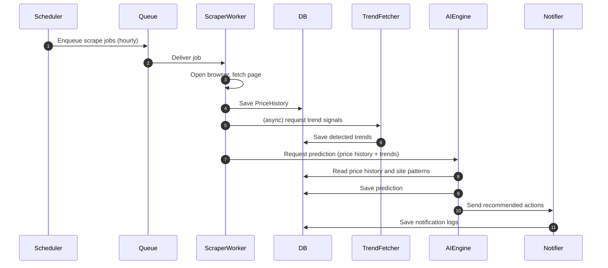

````markdown name=docs/sequence-diagram.md

```mermaid
sequenceDiagram
  autonumber
  participant Scheduler
  participant Queue
  participant ScraperWorker
  participant DB
  participant TrendFetcher
  participant AIEngine
  participant Notifier

  Scheduler->>Queue: Enqueue scrape jobs (hourly)
  Queue->>ScraperWorker: Deliver job
  ScraperWorker->>ScraperWorker: Open browser, fetch page
  ScraperWorker->>DB: Save PriceHistory
  ScraperWorker->>TrendFetcher: (async) request trend signals
  TrendFetcher->>DB: Save detected trends
  ScraperWorker->>AIEngine: Request prediction (price history + trends)
  AIEngine->>DB: Read price history and site patterns
  AIEngine->>DB: Save prediction
  AIEngine->>Notifier: Send recommended actions
  Notifier->>DB: Save notification logs
```
````
